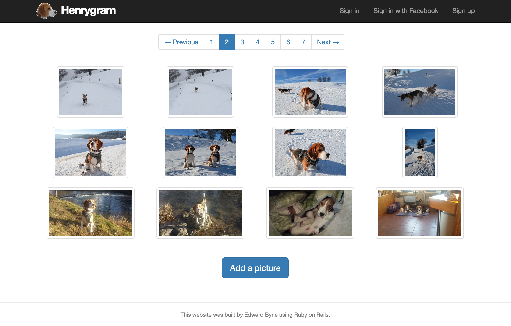
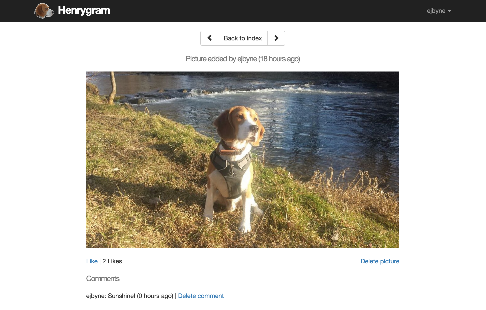

# Henrygram (Ruby on Rails Instagram Clone)

## Summary

My Week 8 challenge at Makers Academy was to build a clone of the Instagram app using Ruby on Rails.

This challenge was a good opportunity to consolidate what I had learned from the [Yelp clone project](https://github.com/ejbyne/rails-yelp) and Michael Hartl's Ruby on Rails [tutorial](https://github.com/ejbyne/rails-twitter).

The app has evolved into somewhat of a homage to my beagle dog Henry, with the intention that it is used for my family and friends to share, like and comment on photos of him on the site!

The app has a user authentication system, including the ability to sign in with Facebook. Uploaded pictures are stored on AWS S3.

The live version of the app (hosted on Heroku) can be viewed [here](https://henrygram.herokuapp.com).

## Technologies used

- Ruby
- Rails
- PostgreSQL
- ActiveRecord
- RSpec
- Capybara
- Gems: Devise, Omniauth, Paperclip, Will_Paginate
- ImageMagick
- AWS S3
- Bootstrap
- HTML
- CSS

## Features

- User can sign up, sign in and sign out (including the option to sign in with Facebook)
- User can upload pictures (with or without a comment)
- User can comment on pictures
- User can like pictures
- User can only add a photo or a comment if he or she has signed in
- User can only delete a photo that he or she has added
- User can only delete a comment that he or she has added
- Picture thumbnails are paginated so that there are a maximum of 12 on each page

## Screenshots

### Homepage

### Picture thumbnails

### Picture view

## To do list

- Improve CSS
- Turn into single page app
- Enable user to search for/filter photos
